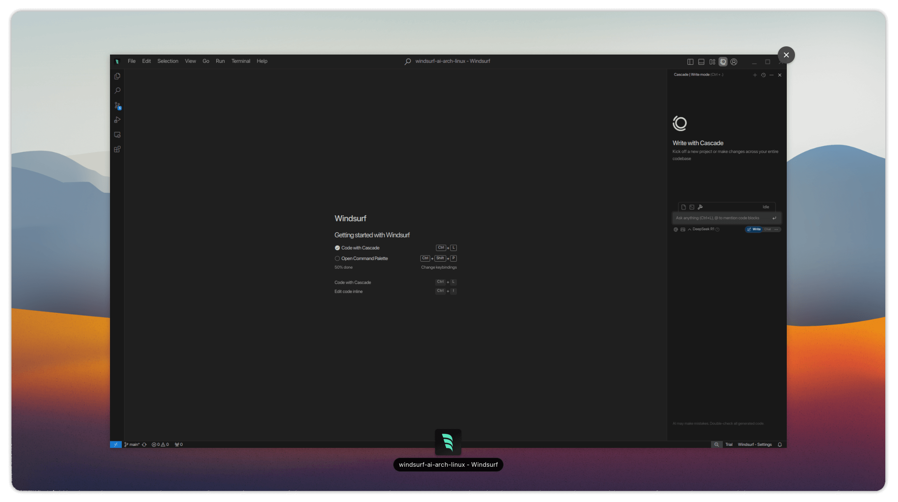

# Codeium Windsurf AI Editor - AUR Package


## ⚠️ Disclaimer

This repository **does not** maintain or develop the Codeium Windsurf AI Editor. It simply provides an AUR package to facilitate installation for Arch Linux users. The package consists of **precompiled binaries** sourced from the official Codeium website.

For issues related to the editor itself, visit the official [Codeium](https://codeium.com/) website.

## 📦 About

[Codeium Windsurf AI Editor](https://codeium.com/) is a standalone code editor based on VS Code, designed to work seamlessly with Codeium's AI-powered coding assistance. However, its official distribution only provides a **tarball download** without proper integration into package managers like `pacman`.

This repository exists **only** to automate the process of installing Codeium Windsurf AI Editor via the AUR.




## 🏗️ Installation (AUR)

Once this package is submitted and accepted into the AUR, you can install it using an AUR helper like `yay`:

```bash
yay -S windsurf-ai-bin
```

Alternatively, you can clone the AUR repository and build it manually:

```bash
git clone https://aur.archlinux.org/windsurf-ai-bin.git
cd windsurf-ai-bin
makepkg -si
```

## 🔄 Updating

Since this package pulls prebuilt binaries, updates depend on new tarball releases from the official Codeium website. If a new version is released and not yet reflected in the AUR package, feel free to submit a pull request or flag the package as outdated.

## 📜 License

This PKGBUILD script itself is under the **MIT License**.

## 🤝 Contributions

This repository is **not actively maintained** beyond keeping the PKGBUILD up to date. If you'd like to contribute, feel free to submit pull requests for version updates or improvements.

## 🛠️ Troubleshooting & Support

- For editor-related issues: **[Codeium Support](https://codeium.com/)**
- For AUR package issues: Open an issue in this repository.

---

**Maintainer Note:** This project simply packages prebuilt binaries from the official Codeium website. It does **not** modify, compile, or maintain the software itself.

